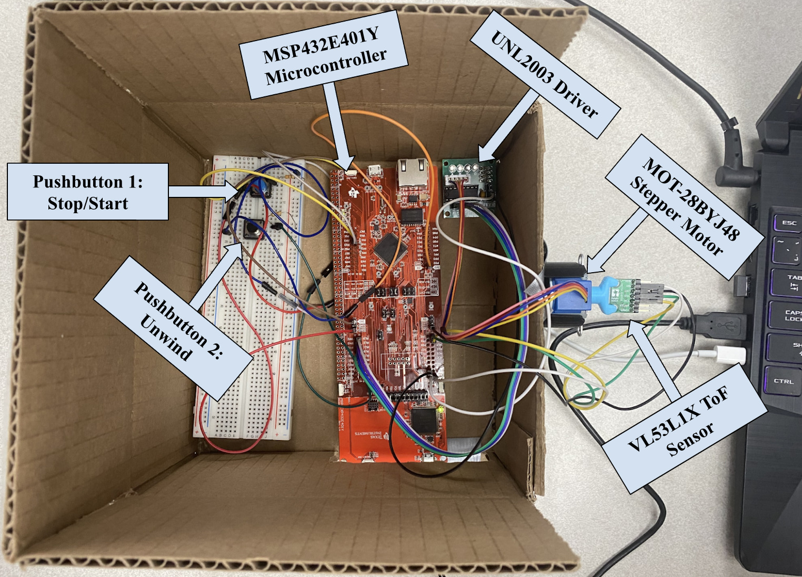

<!-- ABOUT THE PROJECT -->
## About: spatial-mapper

See [spatial-mapper.pdf](spatial-mapper.pdf) for complete report including real-world application.

This project seeks to create an inexpensive and compact alternative to Light Detection and Ranging (LIDAR) equipment using a sensor accompanied with a rotary mechanism. Through a `TI-MSP432E401Y microcontroller`, `VL53L1X time-of-flight (ToF) sensor` and a `MOT-28BYJ48 stepper motor`, the device can collect 3-dimensional spatial data in within a single plane.


<!--  -->



<!-- GETTING STARTED -->
## Getting Started


### Prerequisites

See ```6.Circuit Schematic``` in [spatial-mapper.pdf](spatial-mapper.pdf#page=13) for a complete schematic of hardware orientation.

### Installation

1. Clone the repo
   ```sh
   git clone https://github.com/dominyxu/spatial-mapper.git
   ```
2. Install PIP packages
   ```sh
   pip install numpy
   ```
   ```sh
   pip install pyserial
   ```
   ```sh
   pip install open3d
   ```
3. See [steps 3-12](spatial-mapper.pdf#page=10) from spatial-mapper project report.

